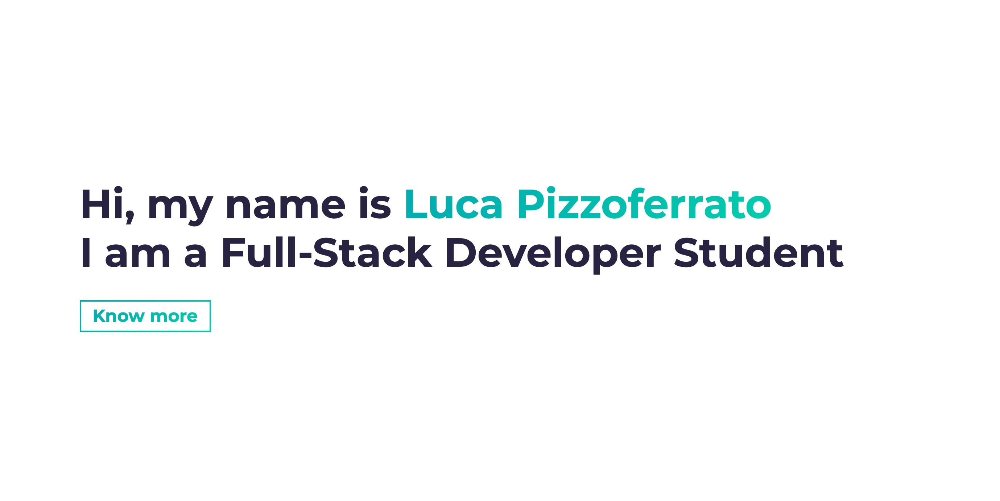
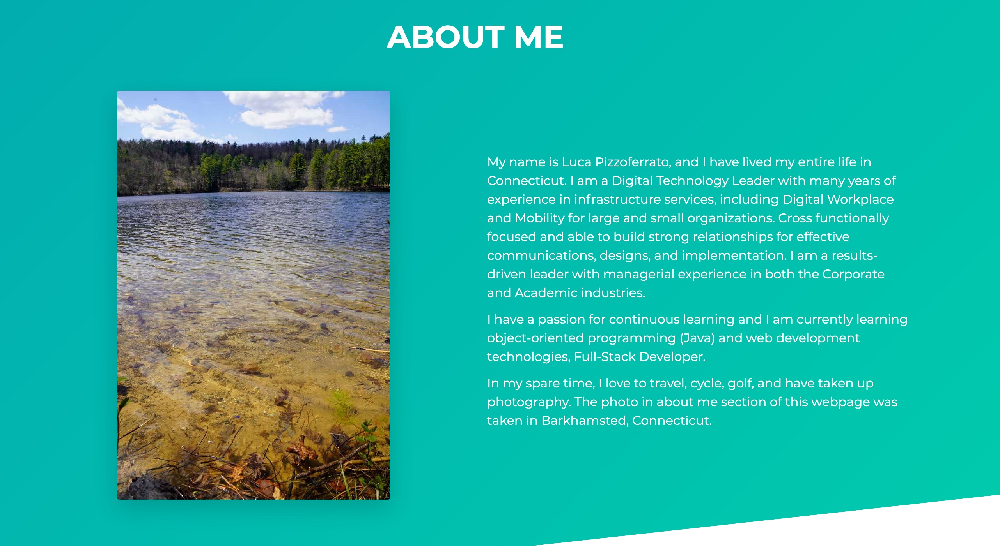
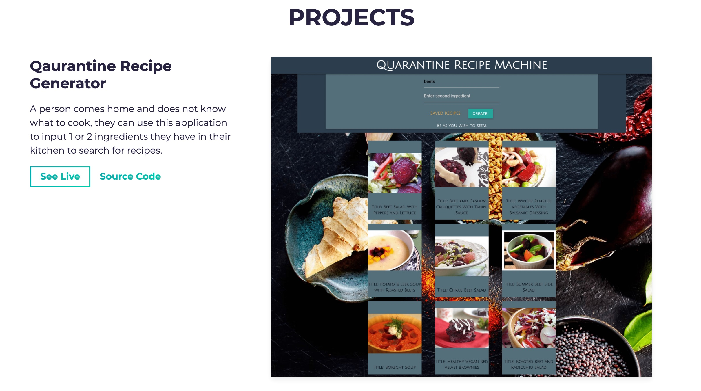

# portfolio-me

 

## Objective

Create a dynamic and updateable portfolio website that showcases "Full Stack Developer" projects, personal experiences, and hobbies.

---

## Site Screen Shots

---

## Webpage

[Portfolio-Me - https://lucpizz.github.io/portfolio-me](https://lucpizz.github.io/portfolio-me/)
